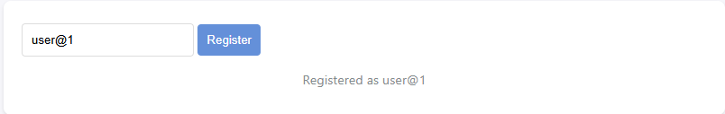
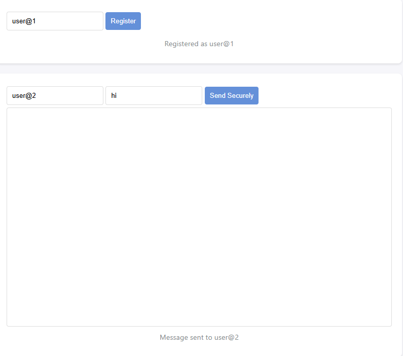
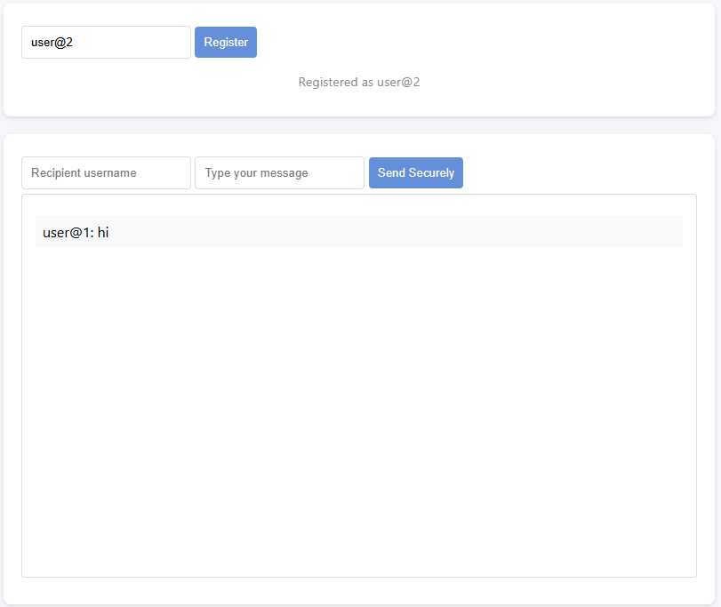

# SecureChat - End-to-End Encrypted Messaging

SecureChat is a simple chat application that focuses on **confidentiality** and **integrity**, two key principles of the CIA triad. It allows two users to communicate securely using end-to-end encryption (E2EE). Messages are encrypted on the sender's side and decrypted only on the recipient's side, ensuring that no one else, including the server, can read the messages.

---

## Features

- **End-to-End Encryption (E2EE)**: Messages are encrypted using RSA-OAEP with a 2048-bit key.
- **Real-Time Communication**: Powered by Socket.IO for near-instant message delivery.
- **Simple UI**: A basic HTML interface for easy usage.
- **Confidentiality and Integrity**: Ensures that messages cannot be read or tampered with during transmission.

---

## Requirements

- **Node.js**: Version 14 or higher.
- **npm**: Installed with Node.js.

---

## Installation

1. Clone the repository:
   ```bash
   git clone <https://github.com/Bigdeal99/Mini-project1.git>
   cd Mini-project1
   ```

2. Install dependencies:
   ```bash
   npm install
   ```

3. Start the server:
   ```bash
   node server/index.js
   ```

4. Open the client:
   - Open your browser and navigate to `http://localhost:3000`.

---

## Usage

1. **Register**:
   - Enter a username in the "Choose a username" field and click "Register".
   - A public-private key pair will be generated and stored locally.

2. **Send a Message**:
   - Enter the recipient's username and your message in the respective fields.
   - Click "Send Securely" to send the encrypted message.

3. **Receive a Message**:
   - Messages sent to you will appear in the chat window, decrypted using your private key.

---

## Cryptographic Implementation

- **Key Pair Generation**:
  - RSA-OAEP keys are generated using the Web Crypto API.
  - The public key is shared with the server, while the private key is stored locally in the browser.

- **Message Encryption**:
  - Messages are encrypted using the recipient's public key before being sent to the server.

- **Message Decryption**:
  - Messages are decrypted using the recipient's private key upon receipt.

- **End-to-End Encryption**:
  - The server only routes encrypted messages and does not have access to the plaintext content.

---

## Screenshots

### Registration


### Sending a Message


### Receiving a Message


---

## Limitations

- **No Group Chats**: The application only supports one-to-one communication.
- **No Perfect Forward Secrecy**: If a private key is compromised, past messages can be decrypted.

---

## Future Improvements

- Implement Perfect Forward Secrecy (PFS) using ephemeral keys.
- Add support for group chats.
- Enhance the UI for better usability.

---

## License

This project is licensed under the MIT License.

---

## Acknowledgments

- **Socket.IO**: For real-time communication.
- **Web Crypto API**: For cryptographic operations.
- **Winston**: For logging server events.